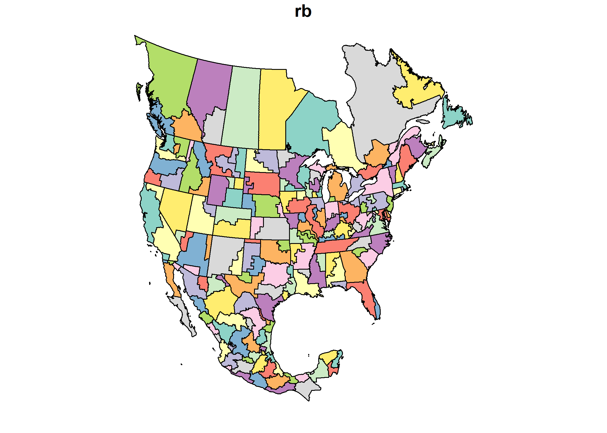
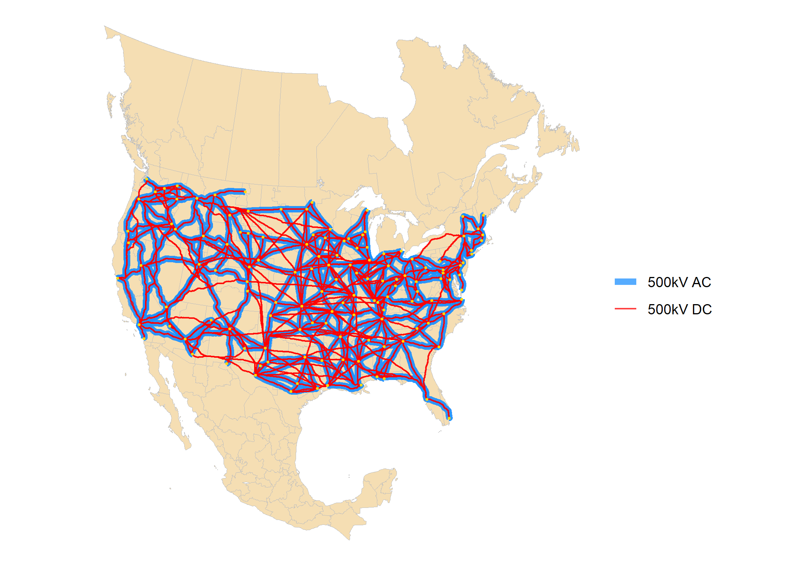

<!-- README.md is generated from README.Rmd. Please edit that file -->

# Reproduction of NREL’s ReEDS-2.0 in energyRt

<!-- badges: start -->

[](https://lifecycle.r-lib.org/articles/stages.html#experimental)
<!-- badges: end -->

The goal of ReEDS is to recreate the National Renewable Energy
Laboratory’s [Regional Energy Deployment System
(ReEDS)](https://github.com/NREL/ReEDS-2.0) model in
[energyRt](https://energyrt.org/), a model generator and make it
available for R, energyRt, and USENSYS users as an option to apply ReEDS
data or the reproduced model itself to their projects.  
The repository is organized as an R-package and will contain the
following components:  
1. Data: ReEDS data and data processing functions.  
2. Model: reproduced in `energyRt` model objects using the ReEDS data.  
3. Maps: spatial data for the ReEDS model.  
4. Reporting functions, methods, and examples.  

The package will not be published on CRAN due to the data size limits.  

## Installation

The package is under development and not yet ready for use. You can
install the development version of ReEDS from
[GitHub](https://github.com/) with:

``` r
# install.packages("pak")
pak::pak("usensys/ReEDS")
```

## Example

Currenlty, the package contains the ReEDS-2.0 regions and transmission
maps.  

``` r
# library(usensys)
library(ReEDS)
library(sf)
#> Linking to GEOS 3.12.1, GDAL 3.8.4, PROJ 9.3.1; sf_use_s2() is TRUE
library(ggplot2)

# maps from ReEDS-2.0 repository, stored in `reed_maps` list-object
#see `?reeds_maps` for details
reeds_maps$US_CAN_MEX_PCA_sf |> st_drop_geometry() |> head()
#>   OBJECTID_1   rb  st   rto interconne country   custreg
#> 1          1 p156 pei rto39    eastern     can    Canada
#> 2          2 p155 nfi rto38     quebec     can    Canada
#> 3          3   p1  wa  rto1       wscc     usa   Pacific
#> 4          4  p10  ca  rto4       wscc     usa   Pacific
#> 5          5 p100  va  rto7    eastern     usa Southeast
#> 6          6 p101  fl rto16    eastern     usa Southeast

plot(reeds_maps$US_CAN_MEX_PCA_sf["rb"])
```

<div class="figure">


<p class="caption">
ReEDS-2.0 regions.
</p>

</div>

``` r
ggplot() +
  geom_sf(data = reeds_maps$US_CAN_MEX_PCA_sf, color = "grey", fill = "wheat") +
  geom_sf(data = reeds_maps$transmission_routes_sf, color = "dodgerblue") +
  geom_sf(data = reeds_maps$transmission_endpoints_sf, color = "red", size = .5) +
  theme_void()
```

<div class="figure">


<p class="caption">
ReEDS-2.0 existing transmission routes and endpoints.
</p>

</div>

``` r
ggplot() +
  geom_sf(data = reeds_maps$US_CAN_MEX_PCA_sf, 
          color = "grey", fill = "wheat") +
  geom_sf(data = reeds_maps$transmission_routes_500kV, 
          aes(color = voltage, linewidth = voltage),
          alpha = .75) +
  scale_color_manual(
    values = c("500kV AC" = "dodgerblue", "500kV DC" = "red"), 
    name = "") +
  scale_linewidth_manual(
    values = c("500kV AC" = 2, "500kV DC" = .5), 
    name = "") +
  geom_sf(data = reeds_maps$transmission_endpoints_sf, 
          color = "gold", size = .5) +
  theme_void()
```

<div class="figure">


<p class="caption">
ReEDS-2.0 new transmission routes
</p>

</div>

## References

ReEDS-2.0 repository:
[NREL/ReEDS-2.0](https://github.com/NREL/ReEDS-2.0) USENSYS docs and
repository: [usensys](https://www.usensys.org/) energyRt docs and
repository: [energyRt](https://energyrt.org/)
